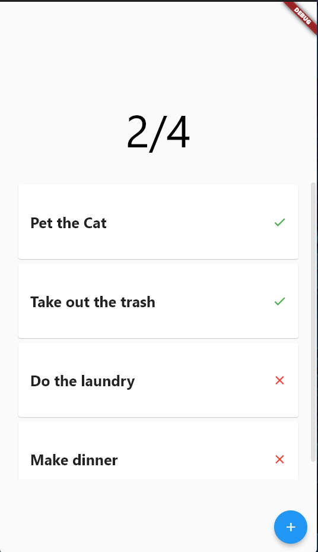

# Todo App

Small Todo App flutter project

## Installation

Use the package manager [flutter](https://flutter.dev/docs/get-started/install) to install f_lesson.

```bash
flutter pub get
```

## Usage

```bash
flutter run
```

## Screenshots


